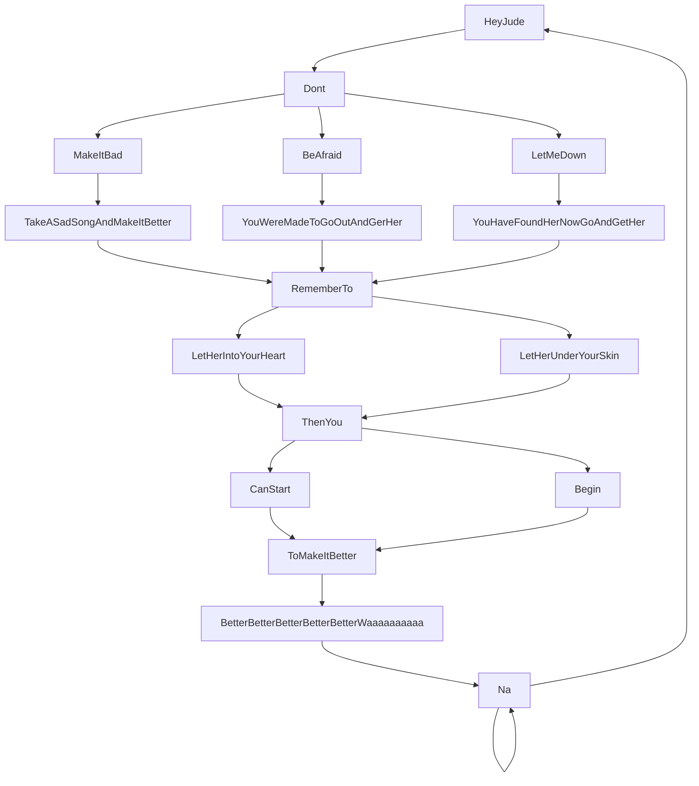

"Hey Jude" is a song by the English rock band the Beatles that was released as a non-album single in August 1968.

It was written by Paul McCartney and credited to the Lennon–McCartney partnership. 

